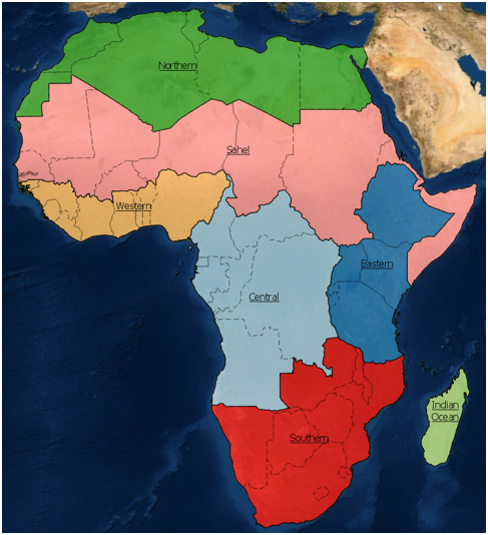

# DE Africa Continental Cropland Mask

## Background

A central focus for governing bodies in Africa is the need to secure the necessary food sources to support their populations. It has been estimated that the current production of crops will need to double by 2050 to meet future needs for food production (GIS Geography, 2018).  Higher level crop-based products that can assist with managing food insecurity, such as cropping watering intensities, crop types, or crop productivity, require as a starting point precise and accurate cropland extent maps indicating where cropland occurs. Current cropland extent maps are either inaccurate, have too coarse spatial resolutions, or are not updated regularly. An accurate, high-resolution, and regularly updated cropland area map for the African continent is therefore recognised as a gap in the current crop monitoring services.  

## Description

The notebooks and scripts in this repository build cropland (crop/non-crop) maps for each of the seven simplified Agro-Ecological Zones (AEZ) shown in figure 1. The process for building models and generating classifications for each AEZ are contained in their namesake folders (e.g. `eastern_cropmask`).

_figure 1: Simplified Agro-Ecological Zones. Seperate cropland models are produced for each region 

The cropland maps all share the following specifications:

* Developed using Sentinel-2 satellite imagery
* Have a spatial resolution of 10 metres
* Developed using data from 2019
* **Cropland definition**: 
    * `A piece of land of minimum 0.16 ha that is sowed/planted and harvest-able at least once within the 12 months after the sowing/planting date.` 
    * This definition will exclude grasslands and perennial crops which can be difficult for satellite imagery to differentiate from natural vegetation.

The `Scripts` folder is duplicated from the `deafrica-sandbox-notebooks` repo and contains useful function for running remote sensing analysis. 

The `pre-post_processing` folder contains notebooks used for various miscellaneous tasks that are not directly associated with producing cropland classifications. These include things like generating randomly placed polygons for training data collection, pre and post processing of reference data, generating ancillary datasets that are used as feature layers in the ML models etc.

