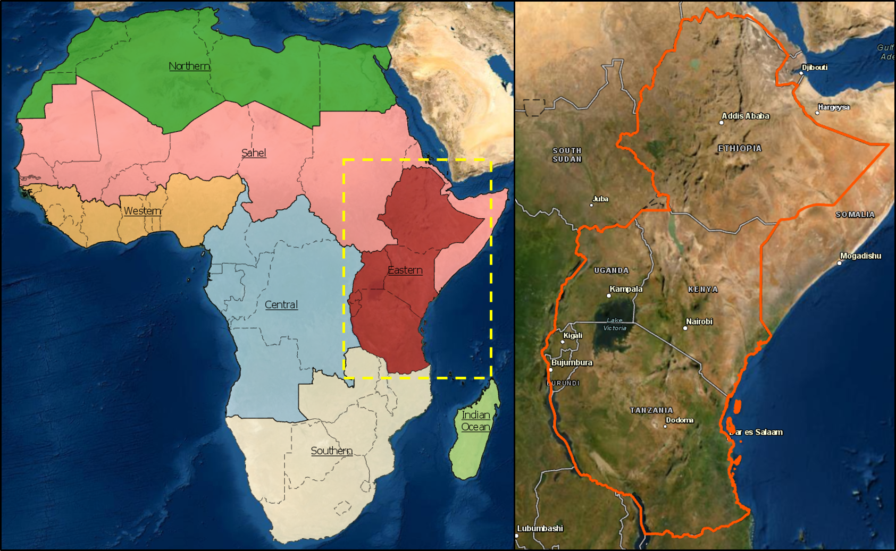
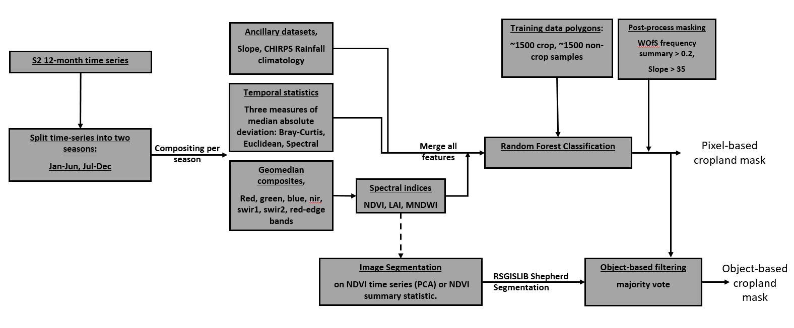

# Eastern Africa Cropland Mask

## Background

A central focus for governing bodies in Africa is the need to secure the necessary food sources to support their populations. It has been estimated that the current production of crops will need to double by 2050 to meet future needs for food production (GIS Geography, 2018).  Higher level crop-based products that can assist with managing food insecurity, such as cropping watering intensities, crop types, or crop productivity, require as a starting point precise and accurate cropland extent maps indicating where cropland occurs. Current cropland extent maps are either inaccurate, have too coarse spatial resolutions, or are not updated regularly. An accurate, high-resolution, and regularly updated cropland area map for the African continent is therefore recognised as a gap in the current crop monitoring services.  

The notebooks in this folder provide the means for generating a cropland mask (crop/non-crop) for the Eastern Africa study region (Figure 1), for the year 2019 at 10m resolution. To obtain classifications a Random Forest algorithm is trained using training data in the `data/` folder (`Eastern_training_data_20201123.geojson`). The entire algorithm is summarised in figure 2.

The definition of cropping used to collect the training data is:

    “A piece of land of minimum 0.16 ha that is sowed/planted and harvest-able at least once within the 12 months after the sowing/planting date.”

This definition will exclude non-planted grazing lands and perennial crops which can be difficult for satellite imagery to differentiate from natural vegetation.

The final classifications are stored in the `results/classifications/` folder, with both predictions and prediction probabilites output.

_Figure 1: Study area for the notebooks in this workflow_

_Figure 2: The algorithm used to generate the cropland mask for Eastern Africa_

---
## Getting Started

There are six notebooks in this collection which, if run sequentially, will reproduce the results stored in the `results/classifications/` folder.
To begin working through the notebooks in this `Eastern Africa Cropland Mask` workflow, go to the first notebook `Extracting_training_data.ipynb`.

1. [Extracting_training_data](https://github.com/digitalearthafrica/crop-mask/blob/main/eastern_cropmask/1_Extract_training_data.ipynb) 
2. [Inspect_training_data](https://github.com/digitalearthafrica/crop-mask/blob/main/eastern_cropmask/2_Inspect_training_data.ipynb)
3. [Train_fit_evaluate_classifier](https://github.com/digitalearthafrica/crop-mask/blob/main/eastern_cropmask/3_Train_fit_evaluate_classifier.ipynb)
4. [Predict](https://github.com/digitalearthafrica/crop-mask/blob/main/eastern_cropmask/4_Predict.ipynb)
5. [Object-based_filtering](https://github.com/digitalearthafrica/crop-mask/blob/main/eastern_cropmask/5_Object-based_filtering.ipynb)
6. [Accuracy_assessment](https://github.com/digitalearthafrica/crop-mask/blob/main/eastern_cropmask/6_Accuracy_assessment.ipynb)

***

## Additional information

**License:** The code in this notebook is licensed under the [Apache License, Version 2.0](https://www.apache.org/licenses/LICENSE-2.0). 
Digital Earth Africa data is licensed under the [Creative Commons by Attribution 4.0](https://creativecommons.org/licenses/by/4.0/) license.

**Contact:** If you need assistance, please post a question on the [Open Data Cube Slack channel](http://slack.opendatacube.org/) or on the [GIS Stack Exchange](https://gis.stackexchange.com/questions/ask?tags=open-data-cube) using the `open-data-cube` tag (you can view previously asked questions [here](https://gis.stackexchange.com/questions/tagged/open-data-cube)).
If you would like to report an issue with this notebook, you can file one on [Github](https://github.com/digitalearthafrica/deafrica-sandbox-notebooks).

**Last modified:** Dec 2020
