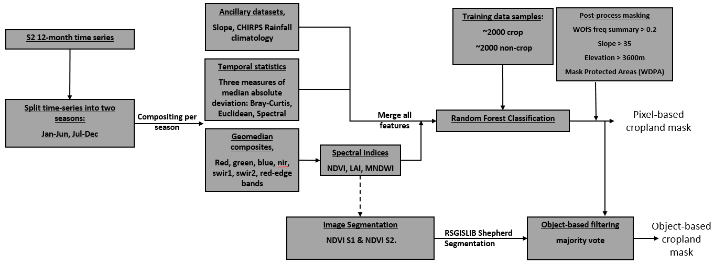

# Central Africa Cropland Mask

## Background

The notebooks in this folder provide the means for generating a cropland mask (crop/non-crop) for the Indian Ocean Africa study region (Figure 1), for the year 2019 at 10m resolution. To obtain classifications a Random Forest algorithm is trained using training data in the `data/` folder (`Central_training_data_<YYYYMMDD>.geojson`). The entire algorithm is summarised in figure 2.

The definition of cropping used to collect the training data is:

    “A piece of land of minimum 0.16 ha that is sowed/planted and harvest-able at least once within the 12 months after the sowing/planting date.”

This definition will exclude non-planted grazing lands and perennial crops which can be difficult for satellite imagery to differentiate from natural vegetation.

_Figure 1: Study area for the notebooks in this workflow_

_Figure 2: The algorithm used to generate the cropland mask for Indian Ocean region of Africa_

---
---
## Getting Started

There are six notebooks in this collection which, if run sequentially, will reproduce Digital Earth Africa's cropmask for the Indian Ocean region of Africa.
To begin working through the notebooks in this `Indian Ocean Africa Cropland Mask` workflow, go to the first notebook `Extract_training_data.ipynb`.

1. [Extract_training_data](1_Extract_training_data.ipynb) 
2. [Inspect_training_data](2_Inspect_training_data.ipynb)
3. [Train_fit_evaluate_classifier](3_Train_fit_evaluate_classifier.ipynb)
4. [Predict](4_Predict.ipynb)
5. [Accuracy_assessment](5_Accuracy_assessment.ipynb)

***

## Additional information

**License:** The code in this notebook is licensed under the [Apache License, Version 2.0](https://www.apache.org/licenses/LICENSE-2.0). 
Digital Earth Africa data is licensed under the [Creative Commons by Attribution 4.0](https://creativecommons.org/licenses/by/4.0/) license.

**Contact:** If you need assistance, please post a question on the [Open Data Cube Slack channel](http://slack.opendatacube.org/) or on the [GIS Stack Exchange](https://gis.stackexchange.com/questions/ask?tags=open-data-cube) using the `open-data-cube` tag (you can view previously asked questions [here](https://gis.stackexchange.com/questions/tagged/open-data-cube)).
If you would like to report an issue with this notebook, you can file one on [Github](https://github.com/digitalearthafrica/crop-mask/issues).
